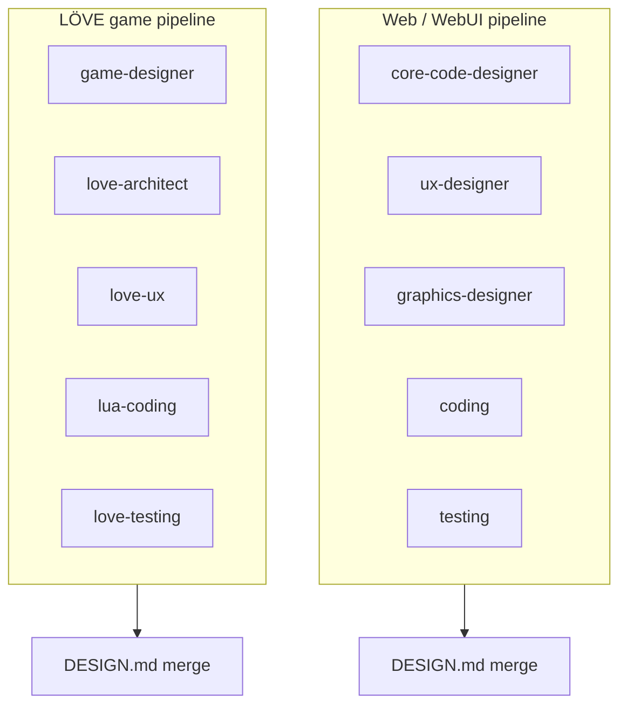

# Agent specialisations — Lua / LÖVE vs Web pipelines

**Branch:** `agent-specialisations`  
**Scope:** Split **game (LÖVE/Lua)** and **web app / web UI** so they use **disjoint** specialist sets. Implement **Option A only:** new LÖVE skill packs; **strip all Lua/LÖVE language** from agents that remain on **web-only** pipelines.  
**Status:** Planning only — execute in follow-up PRs after review.

---

## 1. Strategy (locked): Option A — new skill packs

Add **three** new registry entries and skill packs (names are canonical; aliases in parentheses):

| New `type` / skillPack | Role |
|------------------------|------|
| **`love-architect`** | LÖVE/Lua **software** architecture: module graph, `require` direction, scene stack/registry, update/draw order, `src/systems/` vs entities, `conf.lua` / window strategy, error-handling patterns. **No** game mechanics prose, **no** REST/React. |
| **`love-ux`** (alias: **`game-ui-designer`**) | **In-game** UX: screen map (title → play → pause → game over), controller-friendly navigation, HUD layout *as spec*, focus order, game a11y (readable UI scale). **No** marketing sites, **no** web IA. |
| **`love-testing`** (alias: **`lua-testing`**) | LÖVE/Lua QA: **busted** / `luac -p`, pure Lua module tests, smoke `love .`, what to automate in CI for a Lua repo. **No** Jest/Vitest/pytest as primary path. |

**Keep** existing agents **only** for **non-game / web** pipelines. Their prompts and rules must be **WebApp / WebUI only** — remove every LÖVE, Lua game, busted, and `love.*` API reference.

---

## 2. Web-only agents (mandate after rework)

These agents **must not** implement or prescribe Lua/LÖVE game content. Scope = **web applications and web UI** (SPAs, SSR, REST/GraphQL backends the server describes as HTTP services, design systems for browsers, component libraries, Playwright-style flows for **sites**, etc.).

| Agent | After rework |
|-------|----------------|
| **`core-code-designer`** | System design for **web stacks**: services, REST/GraphQL/WebSocket contracts, JS/TS monorepo layout, React/Vue/Svelte boundaries, env/config — **delete** entire “Game / Lua Expertise” and LÖVE file-tree sections from [`skills/core-code-designer/system-prompt.md`](skills/core-code-designer/system-prompt.md) (and aligned rules). |
| **`ux-designer`** | User flows, wireframes, a11y for **web** products only — **delete** game menus, HUD, character select, controller navigation as in-scope examples. |
| **`graphics-designer`** | Brand/visual design for **web**: tokens, typography, marketing imagery — **delete** sprite sheets, `assets/` game folders, virtual resolution for games. |
| **`testing`** | **Web/backend** testing: Jest, Vitest, Playwright for web, pytest where relevant — **delete** busted, luaunit, LÖVE smoke as primary guidance (defer entirely to `love-testing`). |

**`coding`** (generic) stays web/general implementation; **`lua-coding`** remains the **only** coding agent for LÖVE game implementation.

---

## 3. LÖVE game pipeline — specialist set

When BigBoss selects a **LÖVE / Lua game** task (today: `lua-coding` in the plan, parallel design with multiple designers):

**Design (parallel):**

| Agent | Pack | Responsibility |
|-------|------|----------------|
| **`game-designer`** | `game-designer` | Mechanics, rules, controls, `gameLoop`, `requirementsChecklist`, LÖVE-oriented **high-level** file *names*; **in-game** art/asset conventions at design level (folder naming, style intent) so there is no gap after web `graphics-designer` is stripped of games. |
| **`love-architect`** | `love-architect` | Deep Lua module architecture, dependency direction, scenes, systems — **single owner** for what used to overlap with core-code-designer. |
| **`love-ux`** | `love-ux` | Screens, flows, HUD *structure*, input for UI focus — **single owner** for what used to sit on ux-designer for games. |
| **`graphics-designer`** | **not used** in default LÖVE parallel group | Optional later: fourth pack **`love-graphics-designer`** if art briefs need a dedicated agent; otherwise `game-designer` + `love-ux` carry visual/HUD spec. |

**Coding:** `lua-coding`  
**Validation:** `love-testing` (not `testing`)

---

## 4. BigBoss and registry wiring

- **`BIGBOSS_CONTEXT_BROKER_PROMPT`** ([`bigboss-director.ts`](server/src/bigboss-director.ts)):  
  - **Web tasks:** allowed design agents = `ux-designer`, `core-code-designer`, `graphics-designer`; coding = `coding`; validation = `testing`.  
  - **Game / LÖVE tasks:** allowed design agents = `game-designer`, `love-architect`, `love-ux` (no `ux-designer` / `core-code-designer` / `graphics-designer` in the parallel game bundle); coding = `lua-coding`; validation = `love-testing`.

- **`AGENT_TYPE_TO_DEF`** + **`PARALLEL_DESIGNERS`** ([`pipeline-stages.ts`](server/src/pipeline-stages.ts)):  
  - Introduce **`PARALLEL_LOVE_DESIGNERS`** (or equivalent) listing `game-designer`, `love-architect`, `love-ux`.  
  - **`getAvailableParallelDesigners()`** (or caller) chooses **web list vs love list** based on pipeline mode / BigBoss outcome (e.g. when final coding stage is `lua-coding` or complexity + game signals).

- **`skills/registry.yaml`:** register `love-architect`, `love-ux`, `love-testing` with same category/order pattern as existing designers / validation.

---

## 5. Skill pack deliverables (new)

Each new pack needs at minimum: `system-prompt.md`, `constraints.json`, `cursor-rules.md`, registered in `registry.yaml`, directory under `skills/<pack>/`.

- **`love-architect`:** JSON or markdown sections for `loveArchitecture`, module DAG, scene lifecycle, conf/window; output path e.g. `.pipeline/love-architect-design.md` (align with orchestrator parallel-design pattern).
- **`love-ux`:** Screen list, transitions, HUD regions, controller/keyboard focus; output `.pipeline/love-ux-design.md`.
- **`love-testing`:** busted layout, spec file naming, `luac -p`, optional smoke checklist; may still output JSON for `testCommands` — **Lua-first** only.

---

## 6. Phased execution plan (revised)

| Phase | Deliverable |
|-------|-------------|
| **P0** | Document current BigBoss routing and one golden **web** + one golden **LÖVE** transcript (baseline). |
| **P1** | **Strip** Lua/LÖVE/busted/game UI from `core-code-designer`, `ux-designer`, `graphics-designer`, `testing` prompts + rules — **web only**. |
| **P2** | Add **`love-architect`**, **`love-ux`**, **`love-testing`** packs + `registry.yaml`. |
| **P3** | Wire **`pipeline-stages`**, **`getAvailableParallelDesigners`** (or sibling), **`bigboss-director`** so LÖVE games use the love parallel set + `love-testing`; web games use web set + `testing`. |
| **P4** | Merge / overseer prompts if needed so merged `DESIGN.md` sections map cleanly to new agent names; README agent table; optional **`love-graphics-designer`** if art briefs remain overloaded on `game-designer`. |

**Removed from this plan:** Option B (prompt-only split), “hybrid” recommendation, and phases that only tweaked overlaps without new packs.

---

## 7. Success metrics

- Web pipeline: no LÖVE/Lua/busted language in specialist outputs for a **Next/React**-style task.
- LÖVE pipeline: parallel design includes **only** `game-designer`, `love-architect`, `love-ux` (plus optional future `love-graphics-designer`); validation stage runs **`love-testing`**.
- Fewer merge conflicts between former “core code” and “game design” sections; overseer sees clear ownership.

---

## 8. Out of scope

- Changing **BigBoss** into a single combined overseer/orchestrator agent.
- **Generic `coding`** agent behaviour for non-web stacks (CLI tools, etc.) — treat as follow-up if needed.

---

## 9. Open questions

1. **Detection:** Is **`lua-coding` in the planned stages** sufficient to switch parallel designers to the LÖVE set, or do we need an explicit BigBoss flag (e.g. `stack: "love"`)?  
2. **Graphics gap:** Accept **game-designer** carrying art/asset convention until `love-graphics-designer` exists?  
3. Should **`love-ux`** display name be **“LÖVE Game UI Designer”** in the UI to avoid confusion with **`ux-designer`**?

---

*Updated plan: Option A only; web agents are WebApp/WebUI-only; LÖVE uses `love-architect`, `love-ux`, `love-testing` plus existing `game-designer` and `lua-coding`.*
