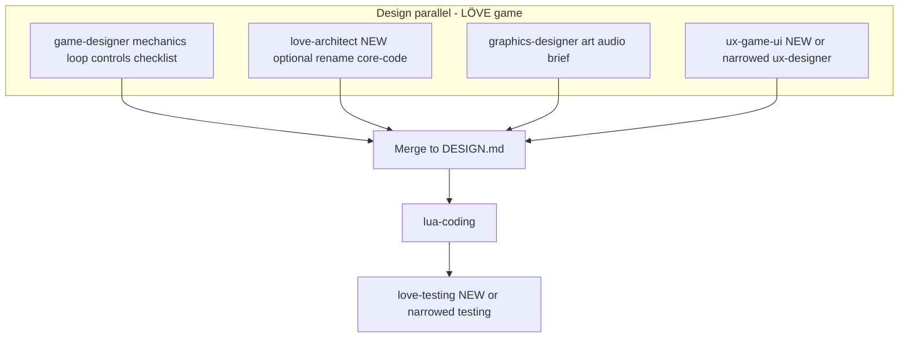

# Agent specialisations — Lua / LÖVE game workflows

**Branch:** `agent-specialisations`  
**Scope:** Improve specialist agents when the pipeline builds or updates a **Lua-based game** (primary target: **LÖVE 11.x**).  
**Status:** Planning only — execute in follow-up PRs after review.

---

## 1. Current agent lineup (Lua game path)

When BigBoss routes a **complex game** task, the design stage typically runs **in parallel**:

| Agent | Skill pack | Intended focus | Risk today |
|-------|------------|------------------|------------|
| **game-designer** | `game-designer` | Mechanics, controls, loop, LÖVE file layout, checklists | Well-scoped for LÖVE |
| **core-code-designer** | `core-code-designer` | “General” architecture + JSON sections + **Game / Lua** bolt-on | **Overlaps** game-designer (module tree, state machines, input layers) |
| **graphics-designer** | `graphics-designer` | Visual tokens, art briefs | Often fine; may blur with UX for in-game HUD |
| **ux-designer** | `ux-designer` | Flows, wireframes, a11y, **game UI** | **Very broad** vs game menus vs product-style UX |
| **lua-coding** | `lua-coding` | Full LÖVE implementation | Correct single owner for code; still absorbs *all* code concerns |
| **testing** | `testing` | Jest/Vitest/pytest **and** busted/Lua | **Jack of all trades** — weak default depth for LÖVE-specific verification |
| **bigboss** | `bigboss` | Plan, overseer, merge context | Not a “specialist” in the same sense |

**Coding stage:** `lua-coding` (not generic `coding`) when BigBoss selects it — already specialised at the *pipeline* level.

---

## 2. Problem statement

1. **Duplicate design authority:** `game-designer` and `core-code-designer` both specify Lua module trees, state machines, and input — merge + overseer must reconcile, and specialists may contradict each other.
2. **UX designer scope:** One agent covers marketing-site-style UX and in-game HUD, menus, character select, and accessibility — different artefacts and success criteria.
3. **Testing agent scope:** One prompt spans web stacks and Lua/busted; for games, we want confident guidance on **pure logic tests**, **minimal LÖVE harness**, and **smoke `love .`** without pretending every project is npm.
4. **Graphics vs gameplay:** Art direction / sprite specs sometimes collide with mechanics (e.g. camera, resolution, parallax) owned by game-designer.

**Goal:** Narrow each agent’s **mandate** and **outputs** so parallel design produces **complementary** documents with fewer merge conflicts and clearer handoff to `lua-coding`.

---

## 3. Target architecture (conceptual)

Two implementation strategies:

- **A — New skill packs (cleanest):** Add `love-architect`, `love-ux` (or `game-ui-designer`), `love-testing` (or `lua-testing`); keep old agents for non-game pipelines.
- **B — Prompt-only split (lighter):** Keep registry types but add **task-class hints** in prompts (e.g. “you are in GAME_MODE — only produce X”); BigBoss injects different preamble. Less registry churn, weaker enforcement.

**Recommendation:** **Hybrid** — (1) tighten existing prompts for game tasks; (2) add **one** new specialist where overlap hurts most (**love-architect** or rename narrow **core-code-designer** for games only); (3) split testing into **lua-game-testing** when `lua-coding` is on the path.

---

## 4. Proposed specialisations (Lua game)

### 4.1 Game designer (`game-designer`) — *tighten, don’t duplicate*

- **Owns:** `requirementsChecklist`, mechanics, controls, `gameLoop`, high-level `fileStructure` *names* (not full dependency graph).
- **Explicit non-goals:** Deep module dependency rules, REST/data models, web architecture — defer to architect agent.
- **Deliverable:** Keep `.pipeline/game-designer-design.md`; ensure merge template prefers game-designer for checklist authority.

### 4.2 Core code designer → **LÖVE software architect** (new or forked pack)

- **Option A:** New agent `love-architect` / skill `love-architect`:
  - **Owns:** Module graph, `require` direction, scene registry/scene stack, ECS-lite vs tables, update/draw order, where systems live (`src/systems/`), error handling patterns, conf/window strategy.
  - **Does not own:** Mechanics copy, control binding tables (reference game-designer).
- **Option B:** Keep `core-code-designer` but add `constraints.json` + prompt branch: when `parallelDesign` and `game-designer` present, **strip** game-mechanics sections and emit **only** `loveArchitecture` JSON.

### 4.3 UX designer → **Game UI / flow designer** (split or mode)

- **Owns:** Screen map (title → options → play → pause → game over), focus order, controller-friendly navigation, HUD layout *as spec* (not art), localisation hooks, readable fonts/sizes (a11y for games).
- **Does not own:** Web app IA, REST flows, or generic “wireframes” unless task is hybrid.
- **Implementation:** Either new `game-ui-designer` skill or a **flag** in BigBoss brief: `context.focus` forces game-UI scope (document in `bigboss-director` broker text).

### 4.4 Graphics designer — *narrow for games*

- **Owns:** Palette, typography *choice*, sprite sheet conventions, resolution/virtual resolution, particle/mood board, asset naming under `assets/`.
- **Does not own:** Game rules, hitboxes (unless purely visual size class).

### 4.5 Lua coding — *phase prompts*

- **Phase 1 prompt (optional):** Scaffold only — `main.lua`, `conf.lua`, empty modules per architect diagram.
- **Phase 2:** Gameplay fill — could be same agent (current) or future split `lua-scene-author` (only if pain appears).

Defer **coder split** until metrics show benefit.

### 4.6 Testing — **Lua game QA**

- **Owns:** `busted` layout, pure function tests for `src/` logic, CI-friendly `luac -p`, optional headless/smoke notes; when to run `love .`.
- **De-emphasise:** Jest/Vitest for pure Lua repos in default prompt when repo is LÖVE-first.
- **Implementation:** New `lua-testing` agent **or** `testing` prompt with **LÖVE_FIRST** branch and stricter output schema (`luaTestFiles`, `loveSmokeSteps`).

---

## 5. Code / config touchpoints

| Area | Files to update |
|------|-----------------|
| Registry | [`skills/registry.yaml`](skills/registry.yaml) — new `type` + `skillPack` entries |
| Pipeline mapping | [`server/src/pipeline-stages.ts`](server/src/pipeline-stages.ts) — `AGENT_TYPE_TO_DEF`, `PARALLEL_DESIGNERS`, `FULL_STAGES` if defaults change |
| BigBoss broker | [`server/src/bigboss-director.ts`](server/src/bigboss-director.ts) — `BIGBOSS_CONTEXT_BROKER_PROMPT` allowed types, game-task rules |
| Parallel designers | [`getAvailableParallelDesigners`](server/src/pipeline-stages.ts) — order and membership |
| Skill packs | `skills/<pack>/system-prompt.md`, `constraints.json`, `cursor-rules.md`, optional `tools.json` |
| Docs | [`README.md`](README.md) agent table; [`server/.env.local.example`](server/.env.local.example) if any new env |

---

## 6. Phased execution plan

| Phase | Deliverable | Risk |
|-------|-------------|------|
| **P0** | Audit: diff outputs from real parallel run (merge conflicts, overseer gaps) | Low |
| **P1** | Prompt-only boundaries: game-designer vs core-code-designer vs ux (no new agents) | Low |
| **P2** | Add **one** new designer agent (`love-architect` or `game-ui-designer`) + registry + BigBoss strings | Medium |
| **P3** | Specialise **testing** for LÖVE path (`lua-testing` or branched prompt) | Medium |
| **P4** | Optional: second coding pass / sub-agent for polish only | Higher |

After each phase: run a **golden task** (e.g. “small LÖVE pong” and “multi-scene menu game”) and compare `DESIGN.md` section overlap and overseer iteration count.

---

## 7. Success metrics

- Fewer overseer **gaps** / **drift** iterations on Lua game tasks.
- Shorter merged `DESIGN.md` with **non-redundant** sections (measurable via duplicate heading count or manual rubric).
- `lua-coding` reports fewer “contradiction” entries in `CODING_NOTES.md`.
- Testing stage produces **runnable** busted/luac instructions on LÖVE samples without web stack noise.

---

## 8. Out of scope (for this plan)

- Non-game pipelines (web-only) — keep existing `coding` + `ux-designer` + `core-code-designer` behaviour unless explicitly unified later.
- Replacing BigBoss with a single mega-agent (separate product decision).
- CI wiring for `busted` in template repos (optional follow-up).

---

## 9. Open questions

1. Should **new** agents appear in the UI agent list and voice intent parsing, or stay pipeline-internal only?
2. Prefer **more agents in parallel** (latency) vs **sequential design substages** (game → architect → UI) for very large games?
3. Should `graphics-designer` be optional for tiny jam games to save tokens?

---

*Prepared on branch `agent-specialisations` for review before implementation.*
