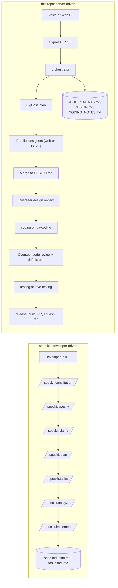

# Assessing GitHub spec-kit vs. none-of-them-knew-they-were-robots

**Status:** Assessment / planning doc — no code has been changed.
**Source material:** [spec-kit-0.md (snapshot of `github/spec-kit` README)](../../../.cursor/projects/c-Users-Chris-none-of-them-knew-they-were-robots/uploads/spec-kit-0.md) and the current repo (server, skills, web).

---

## TL;DR

1. **Same spirit, opposite shape.** Spec-kit is a *single-developer, IDE-driven* slash-command workflow (`/speckit.constitution → specify → clarify → plan → tasks → analyze → implement`). This repo is an *automated, voice/web-UI-driven, parallel-agent pipeline* ([`server/src/orchestrator.ts`](../../server/src/orchestrator.ts)). They overlap on the **what** (spec-first, markdown-driven, human-gated, AI-executed) but disagree on the **how** (slash-commands vs. orchestrated stages; rich per-feature artefact tree vs. single `DESIGN.md`; one agent at a time vs. parallel specialists with merge).
2. **Don't drop spec-kit in.** Drop-in adoption isn't realistic: the `specify` Python CLI duplicates [`skills/registry.yaml`](../../skills/registry.yaml) + [`server/src/skill-loader.ts`](../../server/src/skill-loader.ts), and `/speckit.*` slash-commands assume an interactive IDE chat — not headless `agent --output-format stream-json` runs driven by [`server/src/agent-runner.ts`](../../server/src/agent-runner.ts).
3. **Cherry-pick four ideas.** (a) project-wide `constitution.md` injected into every agent prompt; (b) richer per-feature artefact schema (`spec.md` + `plan.md` + `tasks.md`, optionally `research.md`/`data-model.md`/`contracts/`); (c) explicit `clarify` / `analyze` / `checklist` Overseer sub-stages; (d) the spec-kit community-extension catalog as a feature roadmap.
4. **Recommended next step: Tier 1.** Add `constitution.md` + a `TASKS.md` artefact emitted by BigBoss. Both are small, additive, fit cleanly alongside [`server/src/requirements-artifact.ts`](../../server/src/requirements-artifact.ts), and unblock everything else. **Skip** the `specify` CLI and the slash-command UX as primary surfaces.
5. **Don't break LÖVE.** Any structural change must respect the parallel-design split formalised in [agent-specialisations-lua-game.md](agent-specialisations-lua-game.md) and the LÖVE-specific stages in [`pipeline-stages.ts`](../../server/src/pipeline-stages.ts) (`FULL_STAGES_LOVE`, `PARALLEL_LOVE_DESIGNERS`, `GAME_ART_STAGE`).

---

## What spec-kit actually is

A Python-distributed CLI (`specify`) that scaffolds a `.specify/` skeleton into a project, then exposes a fixed set of slash-commands (or "agent skills") inside ~30 supported coding agents (Claude Code, Cursor, Copilot, Codex CLI, Gemini, Qwen, etc.). The developer drives the workflow manually, one command at a time:

| Command | Produces |
|---|---|
| `/speckit.constitution` | `.specify/memory/constitution.md` — project-wide governing principles |
| `/speckit.specify` | `specs/NNN-name/spec.md` — what + why (no tech) |
| `/speckit.clarify` | Sequential Q&A; appends a *Clarifications* section to `spec.md` |
| `/speckit.plan` | `plan.md`, `research.md`, `data-model.md`, `contracts/` — the how |
| `/speckit.tasks` | `tasks.md` — ordered, dependency-aware, `[P]` parallel markers |
| `/speckit.analyze` | Cross-artefact consistency / coverage report |
| `/speckit.checklist` | Custom quality checklists ("unit tests for English") |
| `/speckit.implement` | Executes `tasks.md` end-to-end |
| `/speckit.taskstoissues` | Pushes tasks → GitHub issues |

It also ships an extension/preset plug-in system with ~80 community packs and a `presets`/`extensions`/`overrides` priority stack resolved at install time.

**What it deliberately is not:** an orchestrator, a server, a queue, a multi-tenant runner, or a parallel-agent merger. There is one developer in one IDE driving one feature branch.

---

## What this repo actually is

Pulled from the [README](../../README.md) and the source:

- **HTTP + SSE server** ([`server/src/server.ts`](../../server/src/server.ts), [`task-store.ts`](../../server/src/task-store.ts)) accepting voice / typed commands and streaming live logs.
- **Pipeline driver** ([`orchestrator.ts`](../../server/src/orchestrator.ts)) that owns stage transitions, human-in-the-loop gates (requirements, design, coding-feedback, cancel), parallel-design merging, and Overseer review loops.
- **BigBoss director** ([`bigboss-director.ts`](../../server/src/bigboss-director.ts)) for planning (OpenAI + CLI fallback), summaries, and Overseer design/code reviews — using [`skills/bigboss/system-prompt.md`](../../skills/bigboss/system-prompt.md) as the persona.
- **Stage definitions** ([`pipeline-stages.ts`](../../server/src/pipeline-stages.ts)) split web vs LÖVE: `FULL_STAGES_WEB`, `FULL_STAGES_LOVE`, `PARALLEL_DESIGNERS`, `PARALLEL_LOVE_DESIGNERS`, `GAME_ART_STAGE`, `RELEASE_STAGE`, `inferStackFromAgents()`.
- **Per-stage prompts + Cursor CLI runner** ([`agent-runner.ts`](../../server/src/agent-runner.ts)) writing `.cursor/mcp.json` per workspace, optionally resuming a long-lived chat via [`cursor-session-registry.ts`](../../server/src/cursor-session-registry.ts).
- **Artefacts on disk:** `REQUIREMENTS.md` ([`requirements-artifact.ts`](../../server/src/requirements-artifact.ts)), `DESIGN.md` (merged from parallel `*-design.md`), `CODING_NOTES.md`, optional `ASSETS.md` + `assets/*.png`, `.pipeline/*.handoff.md`.
- **Skill packs** under [`skills/<agent>/`](../../skills/) with `system-prompt.md` + `constraints.json` + `mcp-config.json` + optional `tools.json` + `rules/`, registered in [`skills/registry.yaml`](../../skills/registry.yaml).
- **Web UI** at [`web/`](../../web/) — single page; no IDE coupling.

---

## Architecture comparison

The two flows can read each other's artefacts (both are markdown on disk) — they just can't share a *driver*.

---

## Concept-by-concept mapping

| spec-kit | this repo | Verdict |
|---|---|---|
| `specify` Python CLI | [`server/src/skill-loader.ts`](../../server/src/skill-loader.ts) + [`registry.yaml`](../../skills/registry.yaml) + `agent-runner` writing `.cursor/mcp.json` per workspace | **Skip.** Direct duplication; adding a Python bootstrap on top of a Node orchestrator is friction with no payoff. |
| `.specify/memory/constitution.md` | (none) — governance is scattered across `skills/<agent>/system-prompt.md` and `skills/<agent>/rules/` | **Adopt.** Highest-value, lowest-cost cherry-pick. |
| `/speckit.specify` → `spec.md` | `REQUIREMENTS.md` (numbered, categorised, traceability marker `<!-- requirements-traceability-linked -->`) via [`generateRequirementsArtifact()`](../../server/src/requirements-artifact.ts) | **Partial overlap.** Today's `REQUIREMENTS.md` covers atomic items; spec-kit's `spec.md` carries user stories + acceptance criteria. Worth widening. |
| `/speckit.clarify` | Optional UI requirements-approval gate; user can request changes which are appended via `appendRequirementsUserRevision()` | **Overlap.** Could be promoted to a structured Q&A sub-stage rather than a free-form gate. |
| `/speckit.plan` → `plan.md` + `research.md` + `data-model.md` + `contracts/` | `DESIGN.md` (merged from parallel `*-design.md`) | **Replace eventually.** Single blob today; spec-kit's split is more useful for downstream Overseer + coding handoff. |
| `/speckit.tasks` → `tasks.md` (with `[P]` parallel markers) | Implicit in `pipeline-stages.ts` (`StageDefinition[]`) and BigBoss `stages[].agents[]` JSON; optional sub-task decomposition for LÖVE | **Adopt.** Emit an explicit `TASKS.md` so coding agents and the UI can read the same authoritative list. |
| `/speckit.analyze` (cross-artefact consistency) | `overseerPostDesignReview` in [`bigboss-director.ts`](../../server/src/bigboss-director.ts) — returns `{ fit: "ok" \| "gaps", gaps[], gapsByAgent }` | **Rename + formalise.** Functionally equivalent; gain by adopting spec-kit's name + JSON shape. |
| `/speckit.checklist` ("unit tests for English") | `LOVE_SMOKE_CHECKLIST` env + Review & Acceptance prompts in BigBoss persona | **Generalise.** Today only LÖVE-specific; spec-kit's idea of *user-defined quality checklists per feature* is broader. |
| `/speckit.implement` | `coding` / `lua-coding` stage with optional sub-tasks + drift fix-ups; lint/build verification; `OPENAI_API_KEY` smoke checklist | **Already covered.** Equivalent functionality exists. |
| `/speckit.taskstoissues` | (none) | **Optional later.** Trivial new stage `release-or-issues`; only useful if you want to fan out tasks to GitHub Issues for tracking. |
| Branches `001-feature-name/` | `workspace clone + branch per task` (existing) | **Already aligned.** |
| `presets` / `extensions` / `overrides` plug-in stack | [`skills/<agent>/`](../../skills/) skill packs + `SKILLS_ROOT` override | **Already aligned in spirit.** Don't migrate; functionally equivalent. |
| Community extensions (e.g. `Worktree Isolation`, `Wireframe Visual Feedback Loop`, `Bugfix Workflow`, `Project Health Check`, `MAQA Multi-Agent`) | Some equivalents exist (`game-art` ≈ wireframe loop for LÖVE; release agent ≈ Ship Release ext); most others not built | **Roadmap fodder.** Use the catalog as a backlog; rebuild interesting ones as native skill packs, don't import. |

---

## Tiered adoption options

Pick one. They're additive — Tier 2 assumes Tier 1 is shipped, Tier 3 assumes Tier 1.

### Tier 0 — Assessment only (this doc)

Ship this document. No code changes. Use it as the briefing for whichever tier comes next.

**Effort:** done.
**Risk:** none.

### Tier 1 — Light cherry-pick (recommended)

Two small, additive features:

1. **Per-project `constitution.md`.**
   - Convention: `<workDir>/.specify/memory/constitution.md` (matches spec-kit) **or** `<workDir>/CONSTITUTION.md` (more discoverable). Pick one in implementation.
   - New loader: `server/src/constitution-artifact.ts` — `loadConstitution(workDir): Promise<string \| null>`.
   - Inject into `agent-runner.buildFullPrompt()` before the per-stage preamble for **every** specialist + BigBoss Overseer call. Empty file → no-op.
   - Optional bootstrap: a one-shot stage `constitution-init` that generates a draft from the user's first task (mirroring `generateRequirementsArtifact()` shape) when none exists.

2. **Explicit `TASKS.md` artefact.**
   - New `server/src/tasks-artifact.ts` writes `<workDir>/TASKS.md` from BigBoss's planned stages JSON after design merge but **before** the coding stage.
   - Format: spec-kit-style numbered tasks grouped by user story, with `[P]` parallel markers and target file paths where known. Cross-link to `REQUIREMENTS.md` IDs.
   - Coding agent prompt (in [`skills/coding/system-prompt.md`](../../skills/coding/system-prompt.md) + [`skills/lua-coding/system-prompt.md`](../../skills/lua-coding/system-prompt.md)) reads `TASKS.md` first, marks `[X]` as it goes.
   - Surfaces in the web UI as a third panel alongside REQUIREMENTS and DESIGN.

**Effort:** ~1–2 days. Two new ~150-line modules + ~30-line edits in `orchestrator.ts`, `agent-runner.ts`, two skill prompts, `web/app.js`, `web/index.html`.

**Risk:** low. Both artefacts are *additive* — failure to load = silent no-op; existing `REQUIREMENTS.md → DESIGN.md → CODING_NOTES.md` flow is unchanged.

**Files touched:**

- New: `server/src/constitution-artifact.ts`, `server/src/tasks-artifact.ts`.
- Edited: [`server/src/orchestrator.ts`](../../server/src/orchestrator.ts) (call new artefact writers between existing stages), [`server/src/agent-runner.ts`](../../server/src/agent-runner.ts) (`buildFullPrompt` injection), [`skills/coding/system-prompt.md`](../../skills/coding/system-prompt.md), [`skills/lua-coding/system-prompt.md`](../../skills/lua-coding/system-prompt.md), [`skills/bigboss/system-prompt.md`](../../skills/bigboss/system-prompt.md) (acknowledge constitution + TASKS).
- UI: [`web/app.js`](../../web/app.js), [`web/index.html`](../../web/index.html) — render two new panels.
- Docs: README agent table + flow diagram, [`server/.env.local.example`](../../server/.env.local.example) (no new env unless we want a `CONSTITUTION_REQUIRED=1` gate).

### Tier 2 — Structural merge

After Tier 1 has bedded in:

1. **Split `DESIGN.md`.** Replace the single merged file with `spec.md` + `plan.md` + `tasks.md` (Tier 1 already wrote `TASKS.md`; rename to `tasks.md` for consistency) + optional `research.md`, `data-model.md`, `contracts/`.
   - Designer skill packs ([`skills/ux-designer/`](../../skills/ux-designer/), [`skills/core-code-designer/`](../../skills/core-code-designer/), [`skills/love-architect/`](../../skills/love-architect/), etc.) get per-artefact output paths.
   - `mergeDesignOutputs()` in `orchestrator.ts` becomes per-artefact (each designer contributes to a named section in each file).
   - Overseer reviews target named files instead of grepping one blob.
2. **Named Overseer sub-stages.** Promote the existing `overseerPostDesignReview` and `overseerPostCodeReview` into discrete stages in [`pipeline-stages.ts`](../../server/src/pipeline-stages.ts) named `clarify`, `analyze`, `checklist` (matching spec-kit). Wire the existing logic into them; expose them as cancellable / re-runnable stages in the UI. This dovetails with [feedback-loop-safeguards.plan.md](feedback-loop-safeguards.plan.md).
3. **Generalise checklists.** Replace the LÖVE-only `LOVE_SMOKE_CHECKLIST` env with a per-task `CHECKLISTS.md` artefact that any stack can populate; LÖVE keeps its current checklist as the default LÖVE bundle.

**Effort:** 4–6 days. Touches the merge pipeline, every design skill prompt, Overseer JSON shapes (compatibility shim needed for one release), web UI, and `task-store.ts` `StageStatus` type.

**Risk:** moderate. The merge pipeline + Overseer JSON contracts are load-bearing; needs feature-flagging (`ARTEFACT_SCHEMA=v2`) and golden-log tests. Must run web + LÖVE goldens before flipping the default.

**Files touched:** add `server/src/spec-artifact.ts`, `server/src/plan-artifact.ts`, `server/src/clarify-stage.ts`, `server/src/analyze-stage.ts`, `server/src/checklist-stage.ts`; significant edits to `orchestrator.ts`, `bigboss-director.ts`, `pipeline-stages.ts`, every designer's `system-prompt.md`, `web/app.js`, `web/index.html`, `packages/shared/src/types.ts`.

### Tier 3 — Coexist with spec-kit

After Tier 2:

- Run `specify init --here --integration cursor` once per workspace clone; let it write its own `.specify/templates/` and `.cursor/commands/`.
- Map the slash-command surface onto pipeline stages: when a developer types `/speckit.plan` inside Cursor, the orchestrator's plan stage runs (via a thin shim that posts to the existing `POST /voice-command` endpoint with a stage hint).
- Optionally consume specific community extensions by porting their prompt content into native skill packs (don't depend on the Python install pipeline at runtime).

**Effort:** 1–2 days for the shim; open-ended for porting community extensions one-by-one.

**Risk:** **high** unless gated to opt-in workspaces. Two artefact schemas living side-by-side is the failure mode. Only do this after Tier 2's schema (which already mirrors spec-kit's) is the default.

**Files touched:** new `server/src/speckit-shim.ts`; small edit to `server/src/server.ts` to accept stage-hinted commands; documentation only beyond that.

---

## Recommended path

1. **Now:** stop at Tier 0 — read this doc, pick a tier.
2. **Next sprint (recommended):** execute Tier 1 as one PR. It is small, useful immediately (the constitution unifies governance that's currently sprinkled across 13 skill packs), and it's the prerequisite for everything else.
3. **Later:** decide between Tier 2 (worth it if Overseer review quality is the limiting factor — and it probably is, per [feedback-loop-safeguards.plan.md](feedback-loop-safeguards.plan.md)) and parking the rest. Tier 3 is only worth doing if you specifically want spec-kit users to drop into a workspace and have their muscle memory work.

---

## Risks / non-goals

- **Don't introduce a Python runtime dependency.** The repo is Node + Cursor CLI; adding a `specify` install step crosses a boundary with no payoff.
- **Don't break the existing artefact contract during transition.** `REQUIREMENTS.md → DESIGN.md → CODING_NOTES.md` is depended on by Overseer prompts, the merge pipeline, and the web UI. Tier 1 is purely additive; Tier 2 needs a feature flag + golden-log diffing before flipping the default.
- **Don't disturb the LÖVE pipeline split.** Per [agent-specialisations-lua-game.md](agent-specialisations-lua-game.md), `core-code-designer` / `ux-designer` / `graphics-designer` are now web-only and `love-architect` / `love-ux` / `love-testing` own LÖVE. Any new artefact schema must keep that split.
- **Don't compete with skill packs by importing the spec-kit extension/preset framework.** Two plug-in systems is a maintenance trap; cherry-pick *content* (prompt ideas) from interesting community extensions into native skill packs as needed.
- **Don't expose slash-commands as the primary UX.** Voice + web UI is the product; slash-commands are at most an opt-in convenience for power users in Cursor.

---

## Open questions for whoever picks Tier 1

1. **Constitution location:** `<workDir>/.specify/memory/constitution.md` (matches spec-kit, preserves any borrowed extensions) or `<workDir>/CONSTITUTION.md` (more discoverable, doesn't introduce a `.specify/` directory implying a wider commitment)?
2. **Constitution authoring:** auto-draft from the first task prompt (like `REQUIREMENTS.md`), or require the human to write it? Mixed: bootstrap if missing, preserve if present.
3. **`TASKS.md` ownership:** does BigBoss own it (planned stages → tasks), or does each designer contribute their own task list which then gets merged (mirroring `DESIGN.md`)? Recommend BigBoss-owned to keep dependency ordering coherent.
4. **`TASKS.md` and the existing `pipeline-stages.ts` `StageDefinition[]`:** is `TASKS.md` *generated from* the stage list (read-only doc), or is it the *source of truth* (orchestrator parses it back)? Recommend read-only first; flip to source-of-truth in Tier 2 if there's demand.
5. **Should Tier 1 also rename `REQUIREMENTS.md` → `spec.md`?** Probably no — keep the rename for Tier 2 to avoid touching every Overseer prompt twice.

---

## Summary recommendation

**Adopt the *ideas* of spec-kit, not the *tool*.** Specifically: ship a `constitution.md` and a `TASKS.md` in the next sprint (Tier 1). Defer the rest until you have data showing the Overseer review loop is the bottleneck. Skip the `specify` CLI, the slash-command UX as a primary surface, and the extension/preset plug-in framework entirely — the equivalents in this repo are already good enough that switching would be a sideways move.
