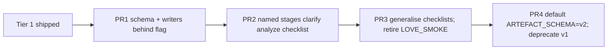
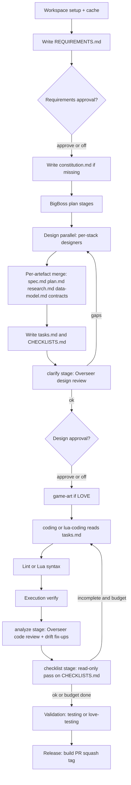

# Tier 2 — Structural artefact + Overseer split

**Status:** Planning only. Execute in PRs after review.
**Prereq:** Tier 1 of [spec-kit-assessment.plan.md](spec-kit-assessment.plan.md) shipped (per-project `constitution.md` injection in [`agent-runner.ts`](../../server/src/agent-runner.ts) `buildFullPrompt()` line ~813, plus `TASKS.md` emitted by BigBoss after design merge).
**Scope owner:** orchestrator + bigboss-director + per-designer skill packs + shared types + web UI.
**Related:** [agent-specialisations-lua-game.md](agent-specialisations-lua-game.md) (must not violate the web/LÖVE designer split), [feedback-loop-safeguards.plan.md](feedback-loop-safeguards.plan.md) (clarify/analyze stages dovetail with the no-approval feedback loop).

---

## 1. Goal in one paragraph

Replace the single monolithic `DESIGN.md` (currently merged in [`mergeDesignOutputs()`](../../server/src/orchestrator.ts) lines 123–217) with a spec-kit-style per-feature artefact tree (`spec.md` + `plan.md` + `tasks.md`, optionally `research.md` + `data-model.md` + `contracts/`); promote [`overseerPostDesignReview()`](../../server/src/bigboss-director.ts) (lines 444–515) and [`overseerPostCodeReview()`](../../server/src/bigboss-director.ts) (lines 517–609) into named, individually-cancellable, individually-rerunnable pipeline stages called `clarify`, `analyze`, and `checklist`; and replace the LÖVE-only [`runLoveSmokeChecklistOpenAI()`](../../server/src/requirements-artifact.ts) (lines 128–182) + `LOVE_SMOKE_CHECKLIST` env with a stack-agnostic `CHECKLISTS.md` artefact.

Result: Overseer reviews target named files instead of grepping a single blob; designer outputs map cleanly to roles; the UI can show / approve / re-run any sub-stage; checklist behaviour generalises beyond LÖVE without changing prompts per stack.

---

## 2. New artefact schema

Per task workspace (`<workDir>/`):

```
spec.md           # what + why (no tech). Replaces the "Original task" + requirements portion of DESIGN.md.
plan.md           # how. Architecture, system design, integration boundaries.
tasks.md          # ordered, dependency-aware list with [P] parallel markers and target file paths. (Tier 1 artefact.)
research.md       # optional. Tech-stack research, library choices, version pins. Web only by default.
data-model.md     # optional. Entities, schemas, relationships. Web only by default.
contracts/        # optional. *.json (OpenAPI / GraphQL / SignalR / IPC schemas). Web only by default.
CHECKLISTS.md     # stack-agnostic per-task quality checklist. Replaces LOVE_SMOKE_CHECKLIST.
REQUIREMENTS.md   # unchanged (Tier 2 keeps numbered atomic requirements; spec.md links to them).
CODING_NOTES.md   # unchanged.
ASSETS.md         # unchanged (LÖVE game-art).
constitution.md   # Tier 1 artefact. Loaded into every agent's preamble.
.pipeline/
  <agent>-spec.md       # parallel designer's contribution to spec.md
  <agent>-plan.md       # parallel designer's contribution to plan.md
  <agent>-research.md   # optional, e.g. core-code-designer
  <agent>-data-model.md # optional, e.g. core-code-designer
  <agent>-handoff.md    # unchanged
```

`DESIGN.md` is **retired** at the end of Tier 2 — but a compatibility shim writes it as a concatenation of `spec.md` + `plan.md` for one release so external readers (community extensions, manual editors) don't break.

### 2.1. Per-designer artefact ownership

| Designer | Owns | Contributes to | Notes |
|---|---|---|---|
| `ux-designer` | `.pipeline/ux-designer-spec.md` (user flows section) | `spec.md` | Web only. |
| `core-code-designer` | `.pipeline/core-code-designer-plan.md`, `-research.md`, `-data-model.md`, `-contracts/` | `plan.md`, `research.md`, `data-model.md`, `contracts/` | Web only; per [agent-specialisations-lua-game.md](agent-specialisations-lua-game.md) §2 must not contain Lua/LÖVE content. |
| `graphics-designer` | `.pipeline/graphics-designer-spec.md` (visual section) | `spec.md` | Web only. |
| `game-designer` | `.pipeline/game-designer-spec.md` | `spec.md` | LÖVE. |
| `love-architect` | `.pipeline/love-architect-plan.md` | `plan.md` | LÖVE; carries module/scene graph. |
| `love-ux` | `.pipeline/love-ux-spec.md` (HUD/screens) | `spec.md` | LÖVE. |
| `game-art` | `ASSETS.md` (unchanged) | — | LÖVE only. |

Single-designer pipelines (`FULL_STAGES_WEB[0]` = `core-code-designer`; `FULL_STAGES_LOVE[0]` = `game-designer`) write directly to `spec.md` + `plan.md` without a `.pipeline/` intermediate.

### 2.2. New `tasks.md` schema

Already established in Tier 1; Tier 2 keeps it. Format (spec-kit-aligned):

```markdown
# Tasks

Generated from plan.md. Mark `[X]` when complete. `[P]` = safe to run in parallel.

## Phase 1: <user story or feature>
- [ ] T1 [P] Create skeleton: `src/foo.ts`
- [ ] T2 Implement core logic: `src/foo.ts` (depends on T1)
- [ ] T3 [P] Write tests: `src/foo.test.ts` (depends on T1)
```

Coding agents read it at start of stage and update `[X]` markers as they go. Drift fix-ups append a new phase rather than editing prior ones.

### 2.3. New `CHECKLISTS.md` schema

Replaces `LOVE_SMOKE_CHECKLIST=1` env behaviour. Generated by BigBoss alongside `tasks.md`, then read by the new `checklist` stage (§3.3):

```markdown
# Checklists

## Acceptance criteria (from spec.md)
- [ ] Player can move with WASD
- [ ] Score persists across restarts (love.filesystem)

## Smoke checks (stack: love)
- [ ] love.load / love.update / love.draw exist
- [ ] No nil access on first frame
- [ ] Movement is bound to keyboard input

## Constitution checks
- [ ] Code matches the project constitution.md (audited by analyze stage)
```

The `Smoke checks` section is stack-derived: web stacks get a smaller default (build passes, no console errors at first render); LÖVE stacks inherit the existing [`OVERSEER_LOVE_CODE_CHECKLIST`](../../server/src/overseer-love-checklists.ts) bullets. The user-facing `Acceptance criteria` section is always present and the `analyze` stage uses it as the primary success signal.

---

## 3. Three named Overseer sub-stages

Today the Overseer logic is two functions called inline from [`orchestrator.ts`](../../server/src/orchestrator.ts) at lines 810 (`overseerPostDesignReview`) and 1170 (`overseerPostCodeReview`). Tier 2 promotes them into discrete, named pipeline stages alongside `design`, `coding`, `validation`, `release`.

### 3.1. `clarify` — between `design` and `tasks-generation`

- **Replaces:** the inline `overseerPostDesignReview` block.
- **Reads:** `spec.md`, `constitution.md`, `REQUIREMENTS.md`.
- **Writes:** appends `## Clarifications` to `spec.md` (matching spec-kit). May trigger a partial designer re-run via `gapsByAgent` (existing logic preserved).
- **JSON contract** (extends current `OverseerDesignReviewResult` in [`bigboss-director.ts`](../../server/src/bigboss-director.ts) lines 112–118):

  ```ts
  export interface ClarifyStageResult {
    fit: "ok" | "gaps";
    gaps?: string[];
    gapsByAgent?: Record<string, string>;
    suggestedSubTask?: { prompt: string };
    /** Tier 2: structured Q&A appended to spec.md when not auto-resolvable. */
    clarifications?: Array<{ question: string; answer?: string; targetAgent?: string }>;
  }
  ```

### 3.2. `analyze` — after `coding` (cross-artefact consistency)

- **Replaces:** the inline `overseerPostCodeReview` block (lines 1165–1273).
- **Reads:** `spec.md`, `plan.md`, `tasks.md`, `data-model.md`, `contracts/`, file tree, key source files (existing `buildContextBrief("code-review", workDir)` in [`bigboss-director.ts`](../../server/src/bigboss-director.ts) line 563).
- **Writes:** `.pipeline/analyze-report.md` with structured drift findings; emits the existing drift-fix-up coding sub-pass via `suggestedSubTask` (preserved).
- **JSON contract** (extends current `OverseerCodeReviewResult` lines 120–126):

  ```ts
  export interface AnalyzeStageResult {
    fit: "ok" | "drift";
    missingOrWrong?: string[];
    focusPaths?: string[];
    suggestedSubTask?: { prompt: string };
    /** Tier 2: per-artefact coverage table. */
    coverage?: {
      specToCode: number;            // 0..1
      tasksCompleted: number;        // 0..1
      contractsHonoured?: number;    // 0..1, undefined when no contracts/
    };
  }
  ```

### 3.3. `checklist` — after `analyze`, before `validation`

- **Replaces:** the LÖVE-specific `runLoveSmokeChecklistOpenAI` call (lines 1275–1292).
- **Reads:** `CHECKLISTS.md` + workspace (read-only OpenAI/CLI pass, no edits).
- **Writes:** ticks `[X]` boxes in `CHECKLISTS.md` for items it can confirm; emits a JSON summary into stage notes for the UI.
- **JSON contract:**

  ```ts
  export interface ChecklistStageResult {
    fit: "ok" | "incomplete";
    items: Array<{ text: string; status: "pass" | "fail" | "unknown"; note?: string }>;
    failed: string[];
  }
  ```

- **Behaviour on `incomplete`:** does not auto-fix; surfaces failures to the UI and (if not at iteration cap) hands off to a single follow-up coding pass with `focusPaths` derived from failed items.

### 3.4. Iteration caps

Reuse existing constants in [`bigboss-director.ts`](../../server/src/bigboss-director.ts) lines 107–110:

| Stage | Constant | Default |
|---|---|---|
| `clarify` | `MAX_OVERSEER_DESIGN_ITERATIONS` | `2` |
| `analyze` | `MAX_OVERSEER_CODE_ITERATIONS` | `2` |
| `checklist` | new `MAX_CHECKLIST_FIX_ITERATIONS` | `1` |

---

## 4. Phased execution

Tier 2 must land in **four sequential PRs** behind a single feature flag `ARTEFACT_SCHEMA=v2` (env, defaults to `v1`). PRs 1–3 are no-op when the flag is `v1`; PR 4 flips the default after golden-log review.



### Phase 1 — schema + writers (PR1)

Add the new artefact files behind `ARTEFACT_SCHEMA=v2`. No behaviour change when flag unset.

- New module `server/src/spec-artifact.ts`:
  - `writeSpecMd(workDir, originalTask, requirements?)` — replaces the "Original task" header logic in [`prependOriginalTaskToDesign()`](../../server/src/orchestrator.ts) lines 118–121.
  - `appendClarifications(workDir, items)` — supports the `clarify` stage in PR2.
- New module `server/src/plan-artifact.ts`:
  - `writePlanMd(workDir, content)` and `mergePlanContributions(workDir, designFiles)` — mirrors [`mergeDesignOutputs()`](../../server/src/orchestrator.ts) lines 123–217 but per-artefact.
  - Optional helpers: `writeResearchMd`, `writeDataModelMd`, `writeContractsDir`.
- New module `server/src/checklists-artifact.ts`:
  - `writeChecklistsMd(workDir, stack, requirements, planSummary)` — replaces LÖVE-specific paths.
  - `tickChecklistItems(workDir, results)`.
- Edit existing modules:
  - [`server/src/orchestrator.ts`](../../server/src/orchestrator.ts) — when flag is `v2`, call new writers in addition to (Phase 1) or instead of (Phase 4) the existing `mergeDesignOutputs`. Wrap lines 800–803 with `if (artefactSchemaV2()) { ... }`.
  - [`server/src/agent-runner.ts`](../../server/src/agent-runner.ts) — `buildFullPrompt()` (line 813) injects `spec.md` + `plan.md` previews instead of `DESIGN.md` preview when flag is `v2`. Keep `DESIGN.md` preview path for v1. The "preview but read full from disk" pattern at lines 903–907 transfers verbatim per file.
  - Designer skill packs — append a v2 output section to each `system-prompt.md`:
    - [`skills/ux-designer/system-prompt.md`](../../skills/ux-designer/system-prompt.md) → "When `ARTEFACT_SCHEMA=v2`, write user-flow section to `.pipeline/ux-designer-spec.md`".
    - [`skills/core-code-designer/system-prompt.md`](../../skills/core-code-designer/system-prompt.md) → "Write architecture to `.pipeline/core-code-designer-plan.md`; optional `.pipeline/core-code-designer-research.md`, `-data-model.md`".
    - [`skills/graphics-designer/system-prompt.md`](../../skills/graphics-designer/system-prompt.md) → spec.md visual section.
    - [`skills/game-designer/system-prompt.md`](../../skills/game-designer/system-prompt.md) → spec.md mechanics section.
    - [`skills/love-architect/system-prompt.md`](../../skills/love-architect/system-prompt.md) → plan.md module/scene section.
    - [`skills/love-ux/system-prompt.md`](../../skills/love-ux/system-prompt.md) → spec.md HUD/screens section.
- Compatibility shim: at end of v2 merge, write a concatenated `DESIGN.md` (`spec.md` + `\n\n---\n\n` + `plan.md`) so downstream code that still reads `DESIGN.md` (Overseer fallback in [`bigboss-director.ts`](../../server/src/bigboss-director.ts) line 488, 561; coding agent prompts) keeps working until PR2/3 finishes the migration.
- Tests:
  - Unit: schema writers; per-designer merge.
  - Integration: web golden + LÖVE golden — assert all v1 artefacts still produced bit-identical when flag unset.

**Risk:** low. PR1 is a strict superset; flag-off path is byte-identical to today.

### Phase 2 — named stages (PR2)

Add `clarify` and `analyze` as discrete `StageDefinition`s in [`pipeline-stages.ts`](../../server/src/pipeline-stages.ts) and groups in [`groupStages()`](../../server/src/pipeline-stages.ts) lines 149–188:

```ts
export const CLARIFY_STAGE: StageDefinition = { name: "clarify", agent: "bigboss", category: "clarify" };
export const ANALYZE_STAGE:  StageDefinition = { name: "analyze",  agent: "bigboss", category: "analyze"  };
export const CHECKLIST_STAGE: StageDefinition = { name: "checklist", agent: "bigboss", category: "checklist" };
```

- Insert order in `runPipeline` ([`orchestrator.ts`](../../server/src/orchestrator.ts) line 633):
  - When `ARTEFACT_SCHEMA=v2`: `[…design…, CLARIFY, GAME_ART_STAGE?, …coding…, ANALYZE, CHECKLIST, …validation…, RELEASE]`.
- Move `overseerPostDesignReview` invocation (lines 810–871) into a new `runClarifyStage()` in `server/src/clarify-stage.ts`. Same JSON parsing, same `gapsByAgent` partial-rerun logic, same iteration cap. The stage emits `taskStore.emit_overseer_log` events with `phase: "clarify"`.
- Move the `overseerPostCodeReview` block (lines 1165–1273) into `server/src/analyze-stage.ts`. Same drift-fix-up + recheck logic.
- Stage status surfacing:
  - Each becomes a regular `StageStatus` entry in `task.stages[]` so the UI can render progress, cancel, or re-run via the existing affordances.
  - The existing `emit_overseer_log` (line 217 of [`task-store.ts`](../../server/src/task-store.ts)) extends to accept `phase: "clarify" | "analyze" | "checklist"` (replace the literal union on line 219).
- Backwards-compat: when flag is `v1`, the new stages are not inserted; the inline Overseer calls continue to fire from their existing locations.

**Risk:** moderate. The existing `groupIndex`-rewinding logic (`continue` after design rerun, lines 868–871; design feedback loop, lines 1311–1326) needs to recognise the new stage categories so partial reruns still target `design`, not `clarify`/`analyze`. Mitigate with explicit `category` checks instead of name checks.

### Phase 3 — generalise checklists (PR3)

- Add `CHECKLIST_STAGE` to the pipeline (between `analyze` and `validation`) when `ARTEFACT_SCHEMA=v2`.
- New `server/src/checklist-stage.ts` runs the read-only OpenAI/CLI pass that consumes `CHECKLISTS.md` and emits `ChecklistStageResult` (§3.3). On `incomplete`, hand off to a single coding fix-up with `focusPaths` (reusing the existing `formatOverseerFocusPaths()` helper at [`orchestrator.ts`](../../server/src/orchestrator.ts) line 112).
- Retire the `LOVE_SMOKE_CHECKLIST=1` branch (lines 1275–1292). Add a deprecation log if env is still set: "LOVE_SMOKE_CHECKLIST is deprecated; CHECKLISTS.md is generated automatically when ARTEFACT_SCHEMA=v2."
- Keep [`runLoveSmokeChecklistOpenAI()`](../../server/src/requirements-artifact.ts) as a private helper called by the new `checklist-stage.ts` for LÖVE stacks. The smoke prompt content moves verbatim; only the trigger surface changes.
- Generate `CHECKLISTS.md` in `bigboss-director.ts` next to `tasks.md` (Tier 1 work): a small additional OpenAI call (`getBigBossModel()`) seeded with `spec.md` + stack identifier; fallback writes a stack-default checklist with no acceptance items.

**Risk:** low–moderate. LÖVE smoke behaviour must remain at parity; covered by golden tests.

### Phase 4 — flip default + deprecate v1 (PR4)

- Default `ARTEFACT_SCHEMA=v2`. `ARTEFACT_SCHEMA=v1` still honoured for one release.
- README rewrite (the [pipeline diagram in README.md](../../README.md) lines 88–115 needs updating to show the new stages).
- Drop the `DESIGN.md` compatibility shim.
- Remove dead v1 code paths in a follow-up PR (PR5, not in scope here).

---

## 5. Per-file impact list

### New files

| File | Purpose | Approx LOC |
|---|---|---|
| `server/src/spec-artifact.ts` | spec.md writer + appendClarifications | ~120 |
| `server/src/plan-artifact.ts` | plan.md / research.md / data-model.md / contracts/ writers + per-designer merge | ~250 |
| `server/src/checklists-artifact.ts` | CHECKLISTS.md generator + ticker | ~140 |
| `server/src/clarify-stage.ts` | runClarifyStage(); houses extracted overseerPostDesignReview wiring | ~180 |
| `server/src/analyze-stage.ts` | runAnalyzeStage(); houses extracted overseerPostCodeReview wiring + drift fix-up | ~260 |
| `server/src/checklist-stage.ts` | runChecklistStage(); read-only checklist pass + optional fix-up | ~160 |
| `web/src/panels.js` (or inline in `app.js`) | render spec / plan / tasks / checklists tabbed panels | ~200 |

### Edited files

| File | What changes | Lines (today) |
|---|---|---|
| [`server/src/orchestrator.ts`](../../server/src/orchestrator.ts) | wrap `mergeDesignOutputs` calls behind flag (line 802); insert CLARIFY/ANALYZE/CHECKLIST stages into `stages[]` (line 633); replace inline Overseer blocks (lines 810–871, 1165–1273, 1275–1292) with stage runners; `groupIndex` rewinding by `category` not `name` | 633, 800–871, 1165–1292, 1311–1326 |
| [`server/src/bigboss-director.ts`](../../server/src/bigboss-director.ts) | export the prompts as constants (`OVERSEER_DESIGN_PROMPT`, `OVERSEER_CODE_PROMPT`) so the new stage modules import them; add `generateChecklists()`; widen `OverseerDesignReviewResult` / `OverseerCodeReviewResult` to the new shapes (§3.1, §3.2); move `MAX_*` constants to a new `server/src/iteration-caps.ts` and re-export | 107–126, 444–609 |
| [`server/src/pipeline-stages.ts`](../../server/src/pipeline-stages.ts) | add `CLARIFY_STAGE`, `ANALYZE_STAGE`, `CHECKLIST_STAGE`; new `injectV2OverseerStages(stages)` helper analogous to `injectPostDesignGameArt` (lines 194–217); new `category` values `"clarify" \| "analyze" \| "checklist"` | 6–10, 50, 132–217 |
| [`server/src/agent-runner.ts`](../../server/src/agent-runner.ts) | `buildFullPrompt()` reads `spec.md`+`plan.md` previews when `ARTEFACT_SCHEMA=v2`, falls back to `DESIGN.md` preview when v1; handle new categories `clarify`/`analyze`/`checklist` in `getPreamble()` (line ~278) — they reuse the existing Overseer preambles with the new artefact paths | 143, 152, 278, 813, 903–937, 985 |
| [`server/src/requirements-artifact.ts`](../../server/src/requirements-artifact.ts) | `runLoveSmokeChecklistOpenAI` becomes private to `checklist-stage.ts`; export remains for v1 compatibility | 128–182 |
| [`server/src/task-store.ts`](../../server/src/task-store.ts) | extend `emit_overseer_log` phase union to include `"clarify" \| "analyze" \| "checklist"`; add new optional `StageStatus` fields: `clarifyResult?`, `analyzeResult?`, `checklistResult?` | 7–23, 217–236 |
| [`packages/shared/src/types.ts`](../../packages/shared/src/types.ts) | add new `TaskStreamEvent` types if needed; add `ArtefactSchemaVersion = "v1" \| "v2"` if exposed to UI | 189–196 |
| [`server/.env.local.example`](../../server/.env.local.example) | document `ARTEFACT_SCHEMA=v2` and the deprecation of `LOVE_SMOKE_CHECKLIST` | n/a |
| [`skills/bigboss/system-prompt.md`](../../skills/bigboss/system-prompt.md) | rewrite Overseer mode sections to reference `spec.md` + `plan.md` + `tasks.md` instead of `DESIGN.md`; add a Checklist Reviewer section mirroring §3.3 | 46–69 |
| [`skills/ux-designer/system-prompt.md`](../../skills/ux-designer/system-prompt.md) | output to `.pipeline/ux-designer-spec.md` | n/a |
| [`skills/core-code-designer/system-prompt.md`](../../skills/core-code-designer/system-prompt.md) | output to `.pipeline/core-code-designer-plan.md` (+ optional research/data-model/contracts under `.pipeline/core-code-designer-*`) | n/a |
| [`skills/graphics-designer/system-prompt.md`](../../skills/graphics-designer/system-prompt.md) | output to `.pipeline/graphics-designer-spec.md` (visual section) | n/a |
| [`skills/game-designer/system-prompt.md`](../../skills/game-designer/system-prompt.md) | output to `.pipeline/game-designer-spec.md` (mechanics section) | n/a |
| [`skills/love-architect/system-prompt.md`](../../skills/love-architect/system-prompt.md) | output to `.pipeline/love-architect-plan.md` (module/scene section) | n/a |
| [`skills/love-ux/system-prompt.md`](../../skills/love-ux/system-prompt.md) | output to `.pipeline/love-ux-spec.md` (HUD/screens section) | n/a |
| [`skills/coding/system-prompt.md`](../../skills/coding/system-prompt.md) and [`skills/lua-coding/system-prompt.md`](../../skills/lua-coding/system-prompt.md) | read `tasks.md` + `spec.md` + `plan.md` instead of `DESIGN.md` when v2; tick `[X]` boxes in `tasks.md` | n/a |
| [`web/index.html`](../../web/index.html) | add tabbed panel skeleton (Spec / Plan / Tasks / Checklists / Constitution) below the existing Approval banner (around current line 1334) | n/a |
| [`web/app.js`](../../web/app.js) | render new artefacts on `task_detail` payload; new approval card variants for `clarify`-stage gaps and `checklist`-stage failures (analogous to existing `approvalType === "design"` branch at line 197) | 33–46, 155–260, 859–869 |
| [`README.md`](../../README.md) | replace the pipeline mermaid (lines 88–115) and the "Workflow and agent interactions" section to describe v2 | n/a |

---

## 6. Pipeline lifecycle (v2)



The `clarify` and `analyze` stages preserve every behaviour of today's inline Overseer reviews — `gapsByAgent` partial reruns, `focusPaths`, `suggestedSubTask` follow-ups, iteration caps, the `BigBoss (Overseer)` log lines.

---

## 7. Web UI changes

Add a tabbed artefacts panel in the existing live view (today the live view shows the Approval banner at [`web/index.html`](../../web/index.html) line ~1334 and stage chips). Tabs:

| Tab | Source file | Read-only? |
|---|---|---|
| Spec | `spec.md` | Yes (edit via `clarify` stage / approval revise) |
| Plan | `plan.md` | Yes |
| Tasks | `tasks.md` | Yes (live `[X]` updates on stage progress events) |
| Checklists | `CHECKLISTS.md` | Yes (live tick on `checklist` stage results) |
| Constitution | `constitution.md` | Yes (Tier 1 artefact) |

Approval card variants (extend the existing switch at [`web/app.js`](../../web/app.js) line 161 / 197 / 233):

- `approvalType === "clarify"` — show structured Q&A from `ClarifyStageResult.clarifications`; user answers each; answers post back as `appendClarifications` payload.
- `approvalType === "checklist"` — show failed items; user can mark `ignore`, `force-pass`, or `request-fix` (which triggers the optional fix-up).

---

## 8. LÖVE pipeline preservation

Per [agent-specialisations-lua-game.md](agent-specialisations-lua-game.md):

- LÖVE parallel designers (`game-designer`, `love-architect`, `love-ux`) keep their split. Their v2 outputs route to:
  - `game-designer` → `.pipeline/game-designer-spec.md` (mechanics + asset conventions)
  - `love-architect` → `.pipeline/love-architect-plan.md` (modules, scenes, lifecycle)
  - `love-ux` → `.pipeline/love-ux-spec.md` (HUD / screens / input focus)
- LÖVE pipelines do **not** generate `data-model.md` / `contracts/` / `research.md` by default. The merge pipeline writes empty placeholders only if a designer explicitly produces a per-agent file.
- The `checklist` stage's "Smoke checks" section for LÖVE inherits the existing [`OVERSEER_LOVE_CODE_CHECKLIST`](../../server/src/overseer-love-checklists.ts) bullets verbatim.
- `injectPostDesignGameArt()` (lines 194–217 of `pipeline-stages.ts`) is unchanged; it still slots `GAME_ART_STAGE` after the last design stage and before coding. v2 inserts `CLARIFY_STAGE` between design merge and `GAME_ART_STAGE`.

---

## 9. Feature flag, rollout, rollback

- **Flag:** `ARTEFACT_SCHEMA` env in [`server/.env.local.example`](../../server/.env.local.example). Values: `v1` (today), `v2`. Default `v1` until PR4.
- **Per-task override:** `RuntimeTask.artefactSchema?: "v1" | "v2"` so a single task can opt in for testing without restarting the server.
- **Golden tests** (`server/test/golden/`): record full SSE log + final workspace tree for one web task and one LÖVE task. Run before each PR with both flag values; compare against committed goldens.
  - Web golden: "Build a TODO React app with localStorage."
  - LÖVE golden: "A platformer with WASD movement and persistent high scores."
- **Rollback:** flag = `v1` reverts behaviour with no code change. PR1–PR3 must always preserve this property.
- **Deprecation timeline:** v2 default in PR4; v1 removed two minor versions later (e.g. v2.6 → v2.8).

---

## 10. Risks

| Risk | Mitigation |
|---|---|
| Overseer prompt drift: moving to per-artefact files changes what the Overseer sees | Phase 1's compatibility shim writes `DESIGN.md` = `spec.md + plan.md` so the existing prompts keep working unchanged through PR1–PR2. PR3+ rewrites prompts. |
| Per-designer merge contention (e.g. two designers wanting to write to `spec.md`) | Each designer writes to its own `.pipeline/<agent>-spec.md` / `-plan.md`. The merge step is the single writer of root-level files. |
| `groupIndex` rewinding logic (orchestrator.ts lines 1311–1326, 1318–1326) targets stage names | Switch to category checks (`category === "design"`) so the new `clarify`/`analyze`/`checklist` stages aren't accidentally rewound to. |
| Overseer JSON contract widening breaks v1 callers | New fields on `OverseerDesignReviewResult` / `OverseerCodeReviewResult` are optional. v1 paths ignore them. |
| Coding agents read DESIGN.md from disk in their own prompts ([`agent-runner.ts`](../../server/src/agent-runner.ts) lines 350, 387, 427) | Update prompts to read `spec.md`+`plan.md`+`tasks.md` when v2; keep `DESIGN.md` shim through PR3. |
| LÖVE pipeline regresses from artefact split | Web/LÖVE parallel designer split is preserved (§8); LÖVE golden test gates each PR. |
| Web UI churn from five tabs | Roll out behind same flag; v1 UI unchanged. |
| Checklist stage adds latency on every coding pass | Single read-only model call; cap at one fix-up; no recursive checklist reruns. |
| Two artefact schemas living simultaneously | Strict feature flag; goldens run both modes; no per-file dual-write outside the compatibility shim. |

---

## 11. Success metrics

- **Overseer false-OK rate** (manual sample of 10 pipelines per stack): target ≤ baseline.
- **Spec→code coverage** (`AnalyzeStageResult.coverage.specToCode`): median ≥ 0.9 across goldens.
- **Mean stage count** stays ≤ 8 for `auto` mode (4 design + clarify + coding + analyze + checklist + validation + release ≤ ~9; trivial tasks skip clarify/analyze).
- **Time to first fix-up** (analyze → coding fix-up): no worse than today's `overseerPostCodeReview → coder fix-up` path (+ ≤ 10% latency budget).
- **No new pipeline crash classes** on either golden over 20 consecutive runs per flag value.

---

## 12. Open questions

1. **Where does `tasks.md` live in v2 — at workspace root (matches spec-kit, easy for humans) or under `.specify/specs/<feature>/tasks.md` (full spec-kit layout)?** Recommend root for now; revisit when/if Tier 3 ships.
2. **Should the `clarify` stage emit a UI Q&A approval card (interactive) or only a pass/fail with appended `## Clarifications`?** Recommend pass/fail in PR2; interactive in a follow-up.
3. **`contracts/`: do we want this for the LÖVE stack at all?** Recommend no by default; allow `love-architect` to opt in if a multi-process / IPC LÖVE design ever appears.
4. **Should `checklist` stage results be advisory-only or block validation?** Recommend advisory-only behind a `CHECKLIST_BLOCKING=1` env (default off).
5. **Compatibility shim lifetime: one minor release or two?** Recommend two — community extensions and manual editors take a release to migrate.
6. **Does v2 change `RuntimeTask.requireDesignApproval` semantics?** Recommend no — the existing approval gates remain on the same logical points (after merged design, before coding); they just see different artefacts.

---

## 13. Out of scope

- Tier 3 (`specify` Python install, slash-command shim into Cursor) — separate plan if pursued.
- Migrating community spec-kit extensions into native skill packs — case-by-case follow-up.
- Replacing `BigBoss` with a long-lived agentic loop — see [long-lived-bigboss-session.plan.md](long-lived-bigboss-session.plan.md).
- Multi-agent parallel coding — see [feedback-loop-safeguards.plan.md](feedback-loop-safeguards.plan.md) §"Multi-Agent Considerations".

---

*This document is a planning artefact only. Execute as four sequential PRs gated on the `ARTEFACT_SCHEMA` env flag; do not begin PR1 until Tier 1 has shipped and golden-test infrastructure exists.*
