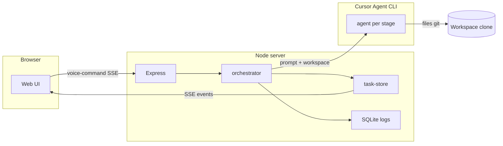
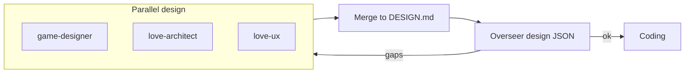

# None of Them Knew They Were Robots

A voice-controlled multi-agent AI design and development team: a **web UI**, a **Node.js server** (Express) that orchestrates pipelines, and the **Cursor Agent CLI** (`agent`) for headless runs.

**Version 2.0 (major)** — AWS CDK, Kubernetes/Helm, the Go operator, and container-based agent runtime were **removed** from this repo. The supported stack is **this server + web UI** only. If you depended on in-tree cloud deployment from the 1.x line, stay on the latest **1.x** tag (e.g. **v1.4.3**) or maintain a fork.

**Version 2.1** — Repository layout was renamed for clarity: the Node backend is **`server/`** (package `@agents/server`), and the browser assets live in **`web/`** at the repo root. Scripts or docs that still reference `test-harness/` or `client/web/` should be updated.

**Version 2.2** — BigBoss planning and Overseer calls are centralised in [`server/src/bigboss-director.ts`](server/src/bigboss-director.ts) with shared stage definitions in [`server/src/pipeline-stages.ts`](server/src/pipeline-stages.ts). Optional **Cursor chat continuity** uses `agent create-chat` plus `--resume` per pipeline (`CURSOR_AGENT_SESSIONS`: `off`, `bigboss`, or `all`; see [`server/.env.local.example`](server/.env.local.example)). The example env file also documents **`CURSOR_AGENT_MODEL`** slugs (run `agent models` for your account).

**Version 2.3** — **LÖVE-focused agents** (`love-architect`, `love-ux`, `love-testing`) and separate web vs LÖVE pipeline stages; web designer/testing prompts no longer cover Lua games. BigBoss can set `stack: "love"` for LÖVE tasks. Overseer supports **per-designer** `gapsByAgent`, LÖVE-specific review checklists, and a bounded **love-testing → lua-coding** retry when validation fails.

**Version 2.4** — **Requirements traceability**: `REQUIREMENTS.md` from each task prompt, linked into `DESIGN.md` after merge; optional **requirements approval** in the web UI. **LÖVE** stack-aware **sub-task decomposition** (locomotion before polish). Overseer **code review** checks **persistent scores** vs RAM-only drift. Optional **`LOVE_SMOKE_CHECKLIST=1`**. Skill packs: in-world visuals, locomotion-first input, love-testing smoke notes.

**Version 2.5** — **Game-art (LÖVE)**: post-design **game-art** stage uses OpenAI **DALL-E 3** via [`packages/openai-sprite-mcp`](packages/openai-sprite-mcp) (`generate_sprite` MCP) when `OPENAI_API_KEY` is set; **ASSETS.md** + PNGs under `assets/` before `lua-coding`. **MCP injection** resolves `__OPENAI_SPRITE_MCP_ENTRY__` and `__PIPELINE_WORKSPACE__` in `.cursor/mcp.json` per clone. **Release** stage instructions match the **merge-to-main** Cursor skill: push, **`npm run build`**, `gh pr create`, **`gh pr merge --squash --delete-branch`**, then annotated **tag on `main`** (see [`skills/release/system-prompt.md`](skills/release/system-prompt.md)).

## Overview

Speak or type a task, and specialist agents — designers, coders, testers — collaborate via Cursor CLI to complete it. New agent types are added mostly through **skill packs** under `skills/`, not by changing the server core.

### Agent team

| Category | Agents | Role | MCP Tools |
|----------|--------|------|-----------|
| **Analysis / Overseer** | BigBoss | Plans pipelines; Overseer reviews (design fit + code drift) | Filesystem, GitHub, Fetch, Sequential Thinking |
| **Design** | UX Designer | Web/product flows, wireframes, a11y | Filesystem, Playwright, Fetch |
| **Design** | Core Code Designer | Web/backend architecture, APIs | Filesystem, GitHub, Fetch |
| **Design** | Graphics Designer | Visual tokens, CSS, web UI | Filesystem, Fetch |
| **Design** | Game Designer | Mechanics, controls, LÖVE game structure | Filesystem, Fetch, Sequential Thinking |
| **Design** | LÖVE Architect / LÖVE UX | Lua modules, scenes/HUD (LÖVE games) | Filesystem, Fetch (Architect also GitHub) |
| **Design** | **Game Art** | Post-design PNG sprites via **DALL-E 3** (MCP `generate_sprite`); **ASSETS.md** — runs only for LÖVE when `OPENAI_API_KEY` is set | Filesystem, Fetch, **openai-sprite-mcp** |
| **Coding** | Coding / Lua coding | Web vs LÖVE implementation | Filesystem, GitHub, Fetch |
| **Validation** | Testing / LÖVE testing | Web tests vs busted / `love .` smoke | Filesystem, Playwright, Fetch |
| **Release** | Release Agent | Same workflow as **merge-to-main**: README, SemVer, push, **build**, PR, **squash-merge**, tag on `main` | Filesystem, GitHub |

BigBoss selects stage agents, runs the Overseer after design merge and after coding, and can trigger focused re-runs. **Design gaps** (post-merge design review) may re-run only the parallel designers listed in **`gapsByAgent`** when that set is a proper subset of the group; otherwise all parallel designers re-run. That is separate from **code drift** (post-coding review), which triggers a **single coding** fix-up (with optional **`focusPaths`**) and may run **one follow-up** code review if iteration budget allows — it does **not** re-run designers. LÖVE stacks get extra Overseer checklists. If **love-testing** fails, the orchestrator can run a bounded **lua-coding** fix-up and retry validation. The **Release** agent runs at the end of a successful pipeline when a repo is configured.

### Architecture

The **same Node process** serves the REST API, **Server-Sent Events** for live task streams, and **static files** for the web UI (`web/`).

```
Browser  --HTTP-->  Express (API + SSE + static web/)
                         |
                         v
              orchestrator (pipeline driver)
                         |
         +---------------+---------------+
         v               v               v
  bigboss-director   agent-runner    task-store / logs
  (plan, summarize,   (Cursor CLI      (SQLite + SSE)
   Overseer reviews)  per specialist)
```

## Workflow and agent interactions

A **task** is created when the UI sends `POST /voice-command` (text or transcribed audio). The server enqueues work and runs [`runPipeline`](server/src/orchestrator.ts) asynchronously. Progress and logs stream to the browser over **Server-Sent Events** (`GET /tasks/:id/stream`); the UI can **approve**, **revise**, or **reject** at gated steps via `POST /tasks/:id/approve`.

### End-to-end data flow



### Pipeline lifecycle (logical order)

Stages depend on **pipeline mode** (`full`, `auto`, `code-test`, `code-only`) and **BigBoss** routing in `auto` mode. **Web** stacks use UX / core-code / graphics designers, **`coding`**, **`testing`**. **LÖVE** stacks use **game-designer**, **love-architect**, **love-ux**, **`lua-coding`**, **`love-testing`**. A **release** stage is appended when applicable.

```mermaid
flowchart TD
  S[Workspace setup + context cache] --> R[Write REQUIREMENTS.md from prompt]
  R --> Q{Requirements approval enabled?}
  Q -->|yes| H1[Human: approve / revise / reject]
  H1 -->|revise| R
  Q -->|no| P[Plan stages BigBoss or fixed]
  P --> D[Design stage(s)]
  D --> M{Multiple parallel designers?}
  M -->|yes| MG[Merge into DESIGN.md]
  M -->|no| MG
  MG --> L[Link REQUIREMENTS in DESIGN if needed]
  L --> OD[Overseer design review]
  OD -->|gaps| D
  OD -->|ok| DA{Design approval enabled?}
  DA -->|yes| H2[Human: approve / revise design]
  DA -->|no| GArt[game-art DALL-E 3 if LÖVE]
  H2 -->|approve| GArt
  H2 -->|revise| D
  GArt --> C[Coding + optional sub-tasks]
  C --> V[Lint / optional love runtime verify]
  V --> OC[Overseer code review + drift fix-ups]
  OC --> SK{LOVE_SMOKE_CHECKLIST=1 and LÖVE stack?}
  SK -->|yes| SM[Optional smoke JSON log]
  SK -->|no| T[Testing stage]
  SM --> T
  T --> RL[Release: build PR merge squash tag on main]
```

### Parallel design merge and Overseer

When several designers run in **parallel**, each writes to `.pipeline/<agent>-design.md`. The orchestrator **merges** them into one root **`DESIGN.md`** (agent merge or OpenAI merge, with fallback). **BigBoss (Overseer)** compares the merged design to the original task; on **gaps**, it can target **`gapsByAgent`** so only some designers re-run. The **Original task** block is always prepended so requirements stay visible to downstream agents.



### Coding agent handoff

The **coding** agent receives a **preamble** (role, self-checks), **DESIGN.md preview** (truncated — full file must be read from disk), optional **`REQUIREMENTS.md` preview**, **file tree**, and **upstream handoffs** from `.pipeline/*.handoff.md`. After coding, the server may run **lint/build** or **Lua syntax** checks, **execution verification** (`npm run build` or `luac`), then **Overseer code review** (implementation vs design + requirements). **Drift** triggers bounded **fix-up** coding passes with optional **`focusPaths`**. With **`requireDesignApproval`**, **`CODING_NOTES.md`** can trigger a **feedback** gate (continue vs re-run design).

### Human-in-the-loop gates

| Gate | When | UI / API |
|------|------|----------|
| **Requirements** | After `REQUIREMENTS.md` is written | Optional checkbox *Require requirements approval*; Approve / Request changes (appends notes) / Reject |
| **Design** | After merged or single design | Optional *Require design approval*; Approve / Revise / Reject |
| **Coding feedback** | When design approval is on and `CODING_NOTES.md` exists | Continue to testing / Re-run design |
| **Cancel** | Any time | `POST /tasks/:id/cancel` |

### Cursor session continuity

[`CURSOR_AGENT_SESSIONS`](server/.env.local.example) controls whether the same **`agent` chat** is resumed per role (`off`, `bigboss`, `all`), so BigBoss and specialists can retain context across iterations within one pipeline run.

**BigBoss in code:** [`server/src/bigboss-director.ts`](server/src/bigboss-director.ts) centralises planning (OpenAI + CLI fallback), human-facing summaries, and Overseer design/code reviews (CLI + API fallback). It prepends the canonical persona from [`skills/bigboss/system-prompt.md`](skills/bigboss/system-prompt.md) to those calls. [`server/src/agent-runner.ts`](server/src/agent-runner.ts) prepends the same file for BigBoss overseer CLI runs and passes `--resume <chatId>` when a session id is set. [`server/src/cursor-session-registry.ts`](server/src/cursor-session-registry.ts) lazily runs `agent create-chat` per `(taskId, agentType)` (see `CURSOR_AGENT_SESSIONS`). Stage definitions live in [`server/src/pipeline-stages.ts`](server/src/pipeline-stages.ts); [`server/src/orchestrator.ts`](server/src/orchestrator.ts) runs the pipeline loop and specialist stages.

Skill packs are read from `skills/` on disk (`SKILLS_ROOT` overrides the path).

## Project structure

```
├── server/                 Node server (Express, SQLite, orchestration)
├── web/                    Browser UI (HTML/JS/CSS; served by server)
├── packages/shared/        Shared types, logging, safety helpers
├── packages/openai-sprite-mcp/  Stdio MCP: DALL-E 3 → PNG (game-art agent)
└── skills/                 Agent skill packs + registry.yaml
```

## Prerequisites

- Node.js 20+
- Cursor Agent CLI (`agent`) on your PATH
- Git
- (Optional) `OPENAI_API_KEY` — BigBoss routing, Whisper when the browser has no SpeechRecognition, summaries, merge/overseer fallbacks

## Quick start (recommended)

From the repository root:

```bash
npm install
cd server
cp .env.local.example .env.local   # optional keys
npx tsx src/server.ts
```

Open **http://localhost:3000** — the UI loads from the server; no separate static host is required.

## Alternate: UI only, remote API URL

You can open `web/index.html` directly (or serve the `web/` folder elsewhere). In the sidebar under **Server**, set **API URL** to your server origin (e.g. `http://localhost:3000`).

## Usage

- **Sidebar** — command, project (workspace, repo, branches, pipeline mode), voice, **design approval**, **requirements approval** (pause before design to edit the extracted checklist), **Server** (API URL), logging level.
- **Live / History** — current run vs past tasks and logs.
- **Voice** — browser SpeechRecognition where available; otherwise server-side Whisper if configured.

Human-in-the-loop: design approval, coding feedback loops, pipeline cancel. See in-app behaviour for iteration limits and summaries.

Structured logs and task history use SQLite at **`server/data/logs.db`**. Notable routes: `GET /logs`, `GET /tasks/history`, `GET /tasks/:id/detail`, `POST /config/log-level`. Debug file logs use the system temp directory under **`agents-robots-logs`**.

## Adding a new agent type

1. Add a directory under `skills/<agent-type>/` with `system-prompt.md`, `constraints.json`, `mcp-config.json`, optional `tools.json` and `rules/`.
2. Register the agent in `skills/registry.yaml`.
3. Restart or rely on disk reads — the server loads packs from `skills/` (or `SKILLS_ROOT`).

## How it works

The server loads skill packs from `skills/` (or `SKILLS_ROOT`), prepares the workspace (clone/checkout optional), writes Cursor rules and MCP config into the workspace, builds **per-stage prompts** in [`agent-runner`](server/src/agent-runner.ts), and runs the **Cursor Agent CLI** (`agent`, or `CURSOR_CLI`). BigBoss planning and Overseer reviews use the same persona file [`skills/bigboss/system-prompt.md`](skills/bigboss/system-prompt.md) where applicable. When a **git repo** is configured, the **release** stage runs the **merge-to-main** flow: README + SemVer, push, **`npm run build`**, `gh pr create`, **`gh pr merge --squash --delete-branch`**, then an annotated **tag on `main`**. See **Workflow and agent interactions** above for the full stage diagram.

## Development

```bash
npm run build

# Dev server with reload
cd server && npm run dev

# Type-check
npx tsc --noEmit -p packages/shared/tsconfig.json
npx tsc --noEmit -p server/tsconfig.json
```

The `web/` package has a simple `npm run dev` (static serve) if you want to iterate on assets against a running API.

### Environment variables (`server/.env.local`)

| Variable | Purpose | Required |
|----------|---------|----------|
| `OPENAI_API_KEY` | Routing, Whisper, summaries, merge/overseer fallbacks, **game-art** DALL-E 3 | Optional |
| `OPENAI_IMAGE_MODEL` | Image model for game-art MCP (default `dall-e-3`) | Optional |
| `PORT` | Listen port (default `3000`) | Optional |
| `SKILLS_ROOT` | Override skills directory | Optional |
| `CURSOR_CLI` | Override Cursor agent binary | Optional |
| `CURSOR_AGENT_MODEL` | Cursor Agent model **slug** for `agent --model` (default `auto`; use `agent models` if `auto` fails) | Optional |
| `CURSOR_AGENT_SESSIONS` | `off` — no resume; `bigboss` — only BigBoss CLI uses `--resume` (default if unset and `BIGBOSS_PERSIST_CLI` not `0`); `all` — each specialist `agentType` gets its own lazy chat per pipeline | Optional |
| `BIGBOSS_PERSIST_CLI` | If `0` and `CURSOR_AGENT_SESSIONS` unset, same as `CURSOR_AGENT_SESSIONS=off` (legacy) | Optional |
| `BIGBOSS_MODEL` | OpenAI model for planning (default `gpt-4o-mini`) | Optional |
| `MERGE_MODEL` | Design merge model (defaults to `BIGBOSS_MODEL`) | Optional |
| `LOVE_SMOKE_CHECKLIST` | If `1`, after a successful LÖVE **coding** stage, log a JSON smoke assessment (movement / persistence) from a read-only model pass | Optional |

### `CURSOR_AGENT_MODEL` syntax

Use the same rules as other `.env` entries:

- **Format:** `CURSOR_AGENT_MODEL=<slug>` — no spaces around `=`.
- **Value:** the model id exactly as shown by the Cursor Agent CLI (lowercase, hyphenated), e.g. `composer-2`, `gpt-5.4-mini-low`.
- **Quotes:** not needed unless your value contains spaces (it should not).
- **Default:** if unset, the server uses `auto`. Some CLI versions do not support `auto` and will error at runtime; run `agent models` and set a concrete slug.

**Authoritative list for your machine and account** (ids and availability change with Cursor updates):

```bash
agent models
```

**Reference slugs** (snapshot; prefer `agent models` above):

<details>
<summary>Click to expand model slug list</summary>

| Slug | Typical label (from CLI) |
|------|---------------------------|
| `claude-4-sonnet` | Sonnet 4 |
| `claude-4-sonnet-1m` | Sonnet 4 1M |
| `claude-4-sonnet-1m-thinking` | Sonnet 4 1M Thinking |
| `claude-4-sonnet-thinking` | Sonnet 4 Thinking |
| `claude-4.5-opus-high` | Opus 4.5 |
| `claude-4.5-opus-high-thinking` | Opus 4.5 Thinking |
| `claude-4.5-sonnet` | Sonnet 4.5 1M |
| `claude-4.5-sonnet-thinking` | Sonnet 4.5 1M Thinking |
| `claude-4.6-opus-high` | Opus 4.6 1M |
| `claude-4.6-opus-high-thinking` | Opus 4.6 1M Thinking |
| `claude-4.6-opus-max` | Opus 4.6 1M Max |
| `claude-4.6-opus-max-thinking` | Opus 4.6 1M Max Thinking |
| `claude-4.6-sonnet-medium` | Sonnet 4.6 1M |
| `claude-4.6-sonnet-medium-thinking` | Sonnet 4.6 1M Thinking |
| `composer-1.5` | Composer 1.5 |
| `composer-2` | Composer 2 |
| `composer-2-fast` | Composer 2 Fast |
| `gemini-3-flash` | Gemini 3 Flash |
| `gemini-3-pro` | Gemini 3 Pro |
| `gemini-3.1-pro` | Gemini 3.1 Pro |
| `gpt-5-mini` | GPT-5 Mini |
| `gpt-5.1` | GPT-5.1 |
| `gpt-5.1-codex-mini` | GPT-5.1 Codex Mini |
| `gpt-5.1-codex-mini-high` | GPT-5.1 Codex Mini High |
| `gpt-5.1-codex-mini-low` | GPT-5.1 Codex Mini Low |
| `gpt-5.1-codex-max-high` | GPT-5.1 Codex Max High |
| `gpt-5.1-codex-max-high-fast` | GPT-5.1 Codex Max High Fast |
| `gpt-5.1-codex-max-low` | GPT-5.1 Codex Max Low |
| `gpt-5.1-codex-max-low-fast` | GPT-5.1 Codex Max Low Fast |
| `gpt-5.1-codex-max-medium` | GPT-5.1 Codex Max |
| `gpt-5.1-codex-max-medium-fast` | GPT-5.1 Codex Max Medium Fast |
| `gpt-5.1-codex-max-xhigh` | GPT-5.1 Codex Max Extra High |
| `gpt-5.1-codex-max-xhigh-fast` | GPT-5.1 Codex Max Extra High Fast |
| `gpt-5.1-high` | GPT-5.1 High |
| `gpt-5.1-low` | GPT-5.1 Low |
| `gpt-5.2` | GPT-5.2 |
| `gpt-5.2-codex` | GPT-5.2 Codex |
| `gpt-5.2-codex-fast` | GPT-5.2 Codex Fast |
| `gpt-5.2-codex-high` | GPT-5.2 Codex High |
| `gpt-5.2-codex-high-fast` | GPT-5.2 Codex High Fast |
| `gpt-5.2-codex-low` | GPT-5.2 Codex Low |
| `gpt-5.2-codex-low-fast` | GPT-5.2 Codex Low Fast |
| `gpt-5.2-codex-xhigh` | GPT-5.2 Codex Extra High |
| `gpt-5.2-codex-xhigh-fast` | GPT-5.2 Codex Extra High Fast |
| `gpt-5.2-fast` | GPT-5.2 Fast |
| `gpt-5.2-high` | GPT-5.2 High |
| `gpt-5.2-high-fast` | GPT-5.2 High Fast |
| `gpt-5.2-low` | GPT-5.2 Low |
| `gpt-5.2-low-fast` | GPT-5.2 Low Fast |
| `gpt-5.2-xhigh` | GPT-5.2 Extra High |
| `gpt-5.2-xhigh-fast` | GPT-5.2 Extra High Fast |
| `gpt-5.3-codex` | GPT-5.3 Codex |
| `gpt-5.3-codex-fast` | GPT-5.3 Codex Fast |
| `gpt-5.3-codex-high` | GPT-5.3 Codex High |
| `gpt-5.3-codex-high-fast` | GPT-5.3 Codex High Fast |
| `gpt-5.3-codex-low` | GPT-5.3 Codex Low |
| `gpt-5.3-codex-low-fast` | GPT-5.3 Codex Low Fast |
| `gpt-5.3-codex-spark-preview` | GPT-5.3 Codex Spark |
| `gpt-5.3-codex-spark-preview-high` | GPT-5.3 Codex Spark High |
| `gpt-5.3-codex-spark-preview-low` | GPT-5.3 Codex Spark Low |
| `gpt-5.3-codex-spark-preview-xhigh` | GPT-5.3 Codex Spark Extra High |
| `gpt-5.3-codex-xhigh` | GPT-5.3 Codex Extra High |
| `gpt-5.3-codex-xhigh-fast` | GPT-5.3 Codex Extra High Fast |
| `gpt-5.4-high` | GPT-5.4 1M High |
| `gpt-5.4-high-fast` | GPT-5.4 High Fast |
| `gpt-5.4-low` | GPT-5.4 1M Low |
| `gpt-5.4-medium` | GPT-5.4 1M |
| `gpt-5.4-medium-fast` | GPT-5.4 Fast |
| `gpt-5.4-mini-high` | GPT-5.4 Mini High |
| `gpt-5.4-mini-low` | GPT-5.4 Mini Low |
| `gpt-5.4-mini-medium` | GPT-5.4 Mini |
| `gpt-5.4-mini-none` | GPT-5.4 Mini None |
| `gpt-5.4-mini-xhigh` | GPT-5.4 Mini Extra High |
| `gpt-5.4-nano-high` | GPT-5.4 Nano High |
| `gpt-5.4-nano-low` | GPT-5.4 Nano Low |
| `gpt-5.4-nano-medium` | GPT-5.4 Nano |
| `gpt-5.4-nano-none` | GPT-5.4 Nano None |
| `gpt-5.4-nano-xhigh` | GPT-5.4 Nano Extra High |
| `gpt-5.4-xhigh` | GPT-5.4 1M Extra High |
| `gpt-5.4-xhigh-fast` | GPT-5.4 Extra High Fast |
| `grok-4-20` | Grok 4.20 |
| `grok-4-20-thinking` | Grok 4.20 Thinking |
| `kimi-k2.5` | Kimi K2.5 |

</details>

A longer commented block with the same slugs lives in [`server/.env.local.example`](server/.env.local.example).

## Licence

Apache 2.0
